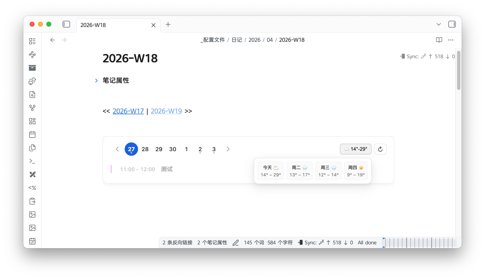

# Dayglance



一个给 Obsidian iframe 用的日程小组件。当前内置日历和天气，后续能力继续按 `src/features/` 扩展。

## 快速开始

```bash
cp config.example.yml config.yml
npm install
npm run start
```

启动后访问：

```text
http://127.0.0.1:8000/today?token=你的ACCESS_TOKEN
http://127.0.0.1:8000/api/today?token=你的ACCESS_TOKEN
```

Obsidian 引用：

```html
<iframe
  src="http://127.0.0.1:8000/today?token=你的ACCESS_TOKEN"
  style="width:100%;border:0;"
></iframe>
```

## 配置

项目使用 `config.yml` 进行结构化配置，按模块划分为：

- `core`: 安全 Token、时区
- `server`: 绑定地址 host、端口 port
- `sync`: 刷新频率、超时设置
- `calendars`: 真实层级嵌套的日历数据源管理
- `weather`: 天气提供商参数（目前仅支持高德 `amap`）

你可以随时参考 `config.example.yml` 中的详细中文注释来进行配置。

## 路由

```text
/today?token=...                      # 默认展示所有日历
/today?token=...&cal=main             # 仅展示 ID 为 main 的日历
/today?token=...&cal=main,work        # 仅展示 ID 为 main 和 work 的日历
/today?token=...&refresh=1            # 强制从远程重新拉取日历数据
```

## 部署

### 本机

```bash
npm run start
```

### VPS 裸机持久化部署

我们推荐使用 `PM2` 进行进程守护，这是 Node.js 社区最流行的部署方式，操作简单且不需要处理繁琐的系统服务配置。

#### 1. 准备项目代码与环境

假设我们将项目部署在 `/opt/dayglance` 目录下：

```bash
# 1. 全局安装 PM2
npm install pm2 -g

# 2. 克隆/上传代码至服务器，进入目录并安装生产依赖
cd /opt/dayglance
npm install --production

# 3. 准备配置文件并填写你的私密信息
cp config.example.yml config.yml
nano config.yml 
```

#### 2. 启动与开机自启

```bash
# 在项目目录下启动服务
pm2 start src/web/server.js --name "dayglance"

# 保存当前运行的服务并设置开机自启
pm2 save
pm2 startup
# PM2 会在终端输出一行 `sudo env PATH...` 的命令，请务必复制并执行那行命令！
```

#### 3. 常用管理命令

```bash
pm2 logs dayglance    # 查看实时运行日志
pm2 restart dayglance # 重启服务
pm2 stop dayglance    # 停止服务
```

#### 4. 反向代理 (可选)

Dayglance 默认运行在 `127.0.0.1:8000`，如需外网访问，建议通过 Nginx 进行反向代理并配置 HTTPS：

```nginx
server {
    listen 80;
    server_name dayglance.yourdomain.com;

    location / {
        proxy_pass http://127.0.0.1:8000;
        proxy_set_header Host $host;
        proxy_set_header X-Real-IP $remote_addr;
        proxy_set_header X-Forwarded-For $proxy_add_x_forwarded_for;
    }
}
```

## 目录

```text
src/core/              # 配置、HTTP、文件工具
src/features/calendar/ # 日历同步和解析
src/features/weather/  # 天气能力
src/web/               # Fastify 路由
views/                 # Nunjucks 模板
public/                # 静态资源
storage/               # 运行时缓存
tests/                 # 回归测试
```

## 开源协议

本项目采用 [MIT License](LICENSE) 协议开源。你可以自由地使用、修改和分发，但请保留原作者信息。

**作者**: 小橙子🍊  
**GitHub**: [@xczlife](https://github.com/xczlife)

